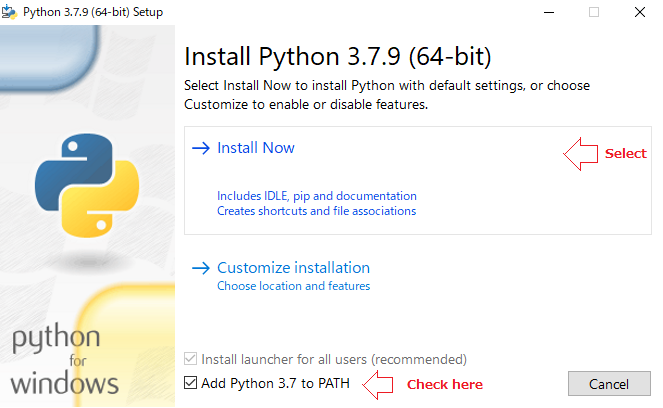
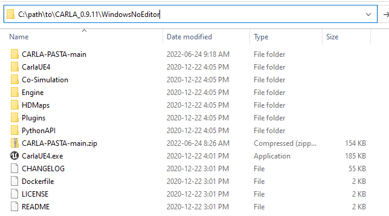

# PASTA-CARLA CoSim Installation Guide
## Prerequisites
* DirectX End-User Runtime (Legacy DirectX libraries)
* Python 3.7.9
* CARLA 0.9.11

## DirectX End-User Runtime Installation
1. Please download DirectX libraries from https://www.microsoft.com/en-us/download/details.aspx?id=35
1. Install to launch ```dxwebsetup.exe```

## Python 3.7.9 Installation
1. Please download a Python 3.7.9 (64 bit) installer from https://www.python.org/downloads/windows/
1. Put this installer into `CARLA-PASTA` (or `CARLA-PASTA-main` if downloaded this repository as a ZIP)
1. Double-click `InstallPython4CARLA.bat` in the `CARLA-PASTA` folder.
1. A terminal will open as well as the Python installer
1. During the installation process, please check your installer screen as the following screenshot shows. Then follow the installer instructions.
    
1. After the Python installation, the terminal window will prompt you for a password to be able to use the newly installed Python to install additional Python packages listed below
    ```
    numpy==1.19.5
    pygame==2.0.0
    pyserial==3.4
    networkx==2.5
    ```

## CARLA 0.9.11 Installation
1. Download CARLA 0.9.11 from https://carla-releases.s3.eu-west-3.amazonaws.com/Windows/CARLA_0.9.11.zip
1. Unzip CARLA_0.9.11.zip

## Add PASTA-CARLA to CARLA 0.9.11
1. Inside the extracted CARLA_0.9.11 there is a folder WindowsNoEditor
1. Place the CARLA-PASTA folder inside the WindowsNoEditor folder to look like the following image:

 

### Optionally Improve Autopilot Performance
The following steps improve the performance of the autopilot used by PASTA-CARLA. It is not necesary to do these steps however, the framerate of the application when using the autopilot improves.
1. Move the file `behavior_agent.py` to `CARLA_0.9.11\WindowsNoEditor\PythonAPI\carla\agents\navigation\behavior_agent.py`
1. Replace the existing file

## Start PASTA-CARLA
1. Navigate to `C:\path\to\CARLA_0.9.11\WindowsNoEditor\CARLA-PASTA`
1. Start the GUI by running: `python.exe .\gui.py`
